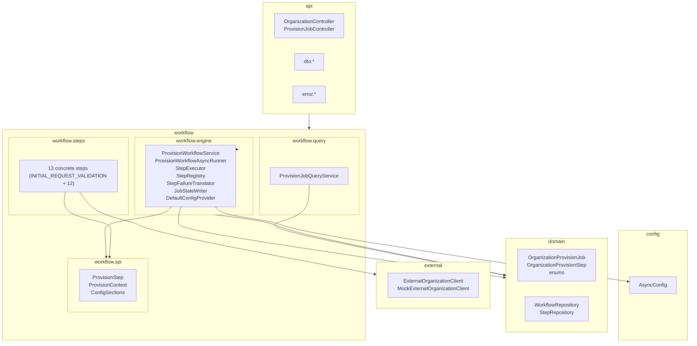
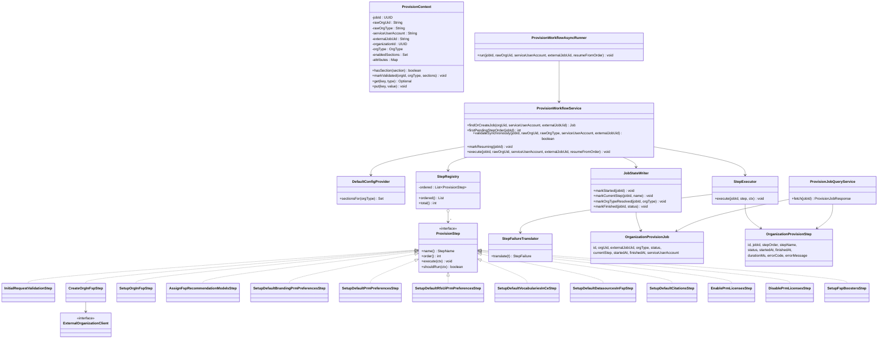
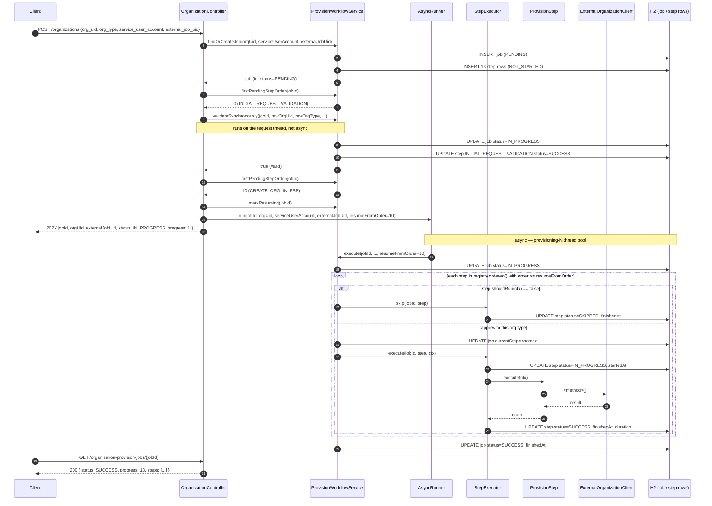
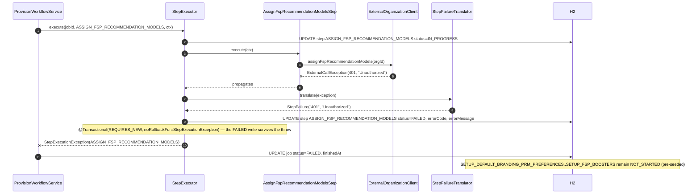
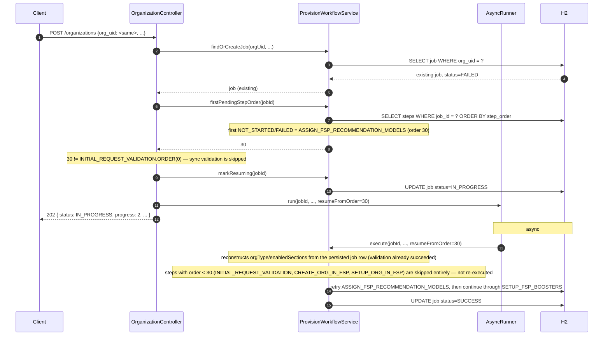
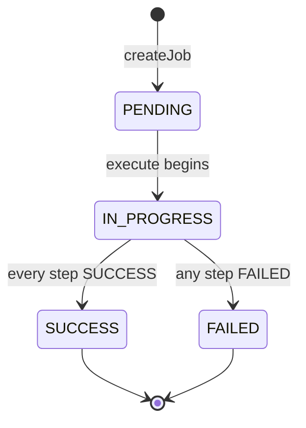
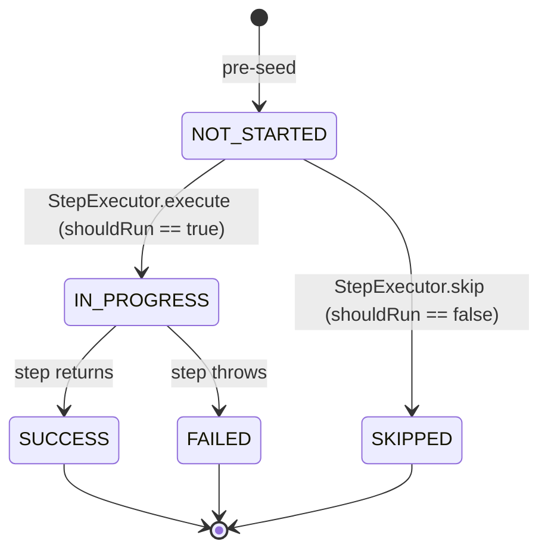
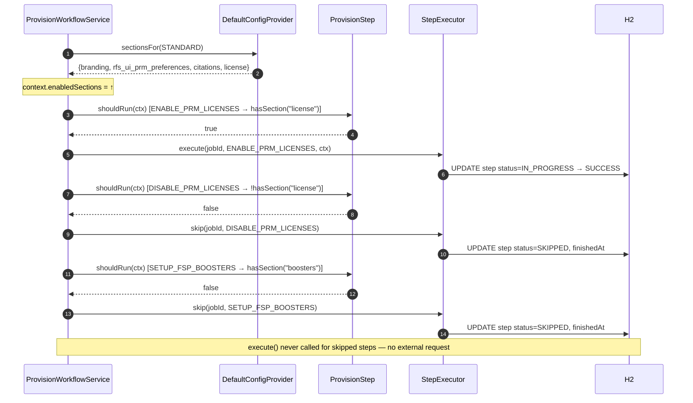

# Diagrams

All diagrams are Mermaid — GitHub renders them inline in the browser and they diff cleanly in pull requests.

## Package diagram

## Class diagram

## Sequence — successful workflow

## Sequence — failed workflow

## Sequence — retry resumes at the failed step

Same request body, same `org_uid`, resubmitted after the failure above.
`CREATE_ORG_IN_FSP` / `SETUP_ORG_IN_FSP` (already `SUCCESS`) and
`INITIAL_REQUEST_VALIDATION` (already `SUCCESS`) are **not** re-run —
`resumeFromOrder` skips every step ordered below the first non-terminal
one.

## State transitions

### Workflow status

### Step status

A step is pre-seeded `NOT_STARTED`. When the orchestrator reaches it,
`ProvisionStep.shouldRun(context)` decides the branch: `true` → the
step executes (`IN_PROGRESS` → `SUCCESS`/`FAILED`); `false` → the step
is recorded `SKIPPED` and never invoked. `SKIPPED` is a terminal
success-like state — it counts toward `progress` and does **not** fail
the job.

## Sequence — conditional skip (SKIPPED)

The request's `org_type` must exactly match one of the `OrgType` enum
constants (`STANDARD` / `INTERNAL` / `ENTERPRISE`) — `INITIAL_REQUEST_VALIDATION`
parses it via `OrgType.valueOf(...)` (no case-insensitive or alias mapping)
and publishes it onto the context via `markValidated`; `DefaultConfigProvider`
resolves that type's enabled sections. Each later step's `shouldRun(ctx)`
checks its section — a missing section means the step is skipped with no
external call.

Shown for `org_type = "STANDARD"`, whose profile has `license` but not
`boosters`: `ENABLE_PRM_LICENSES` runs, `DISABLE_PRM_LICENSES` and
`SETUP_FSP_BOOSTERS` are skipped.

