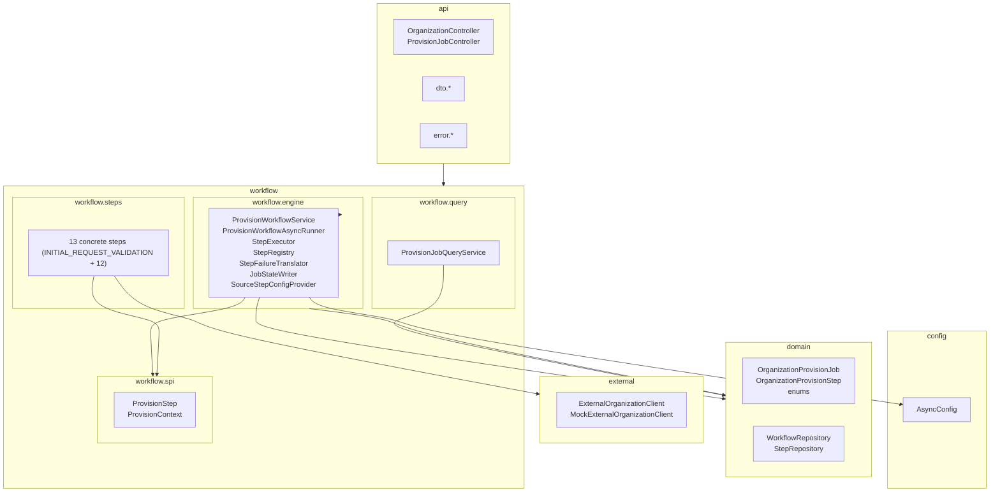
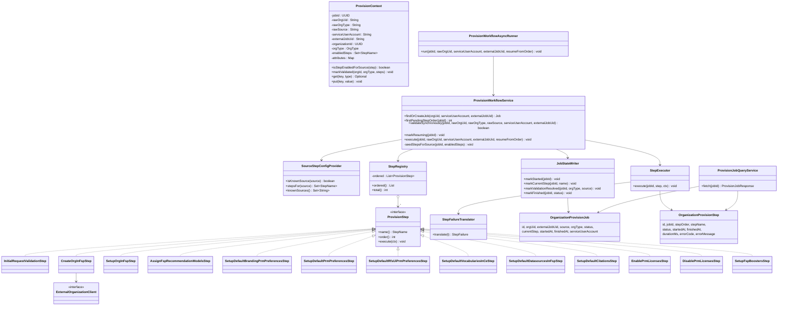
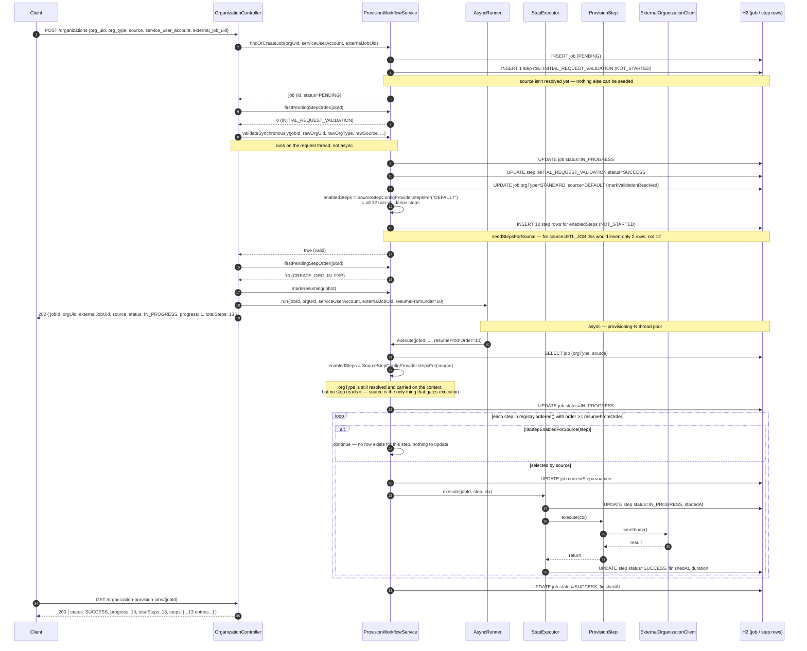
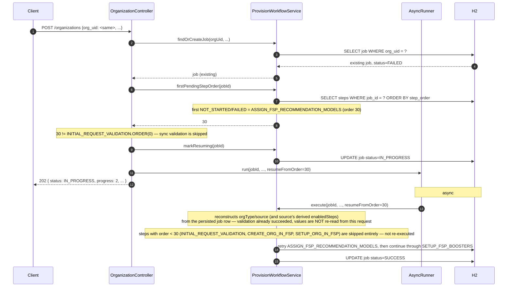
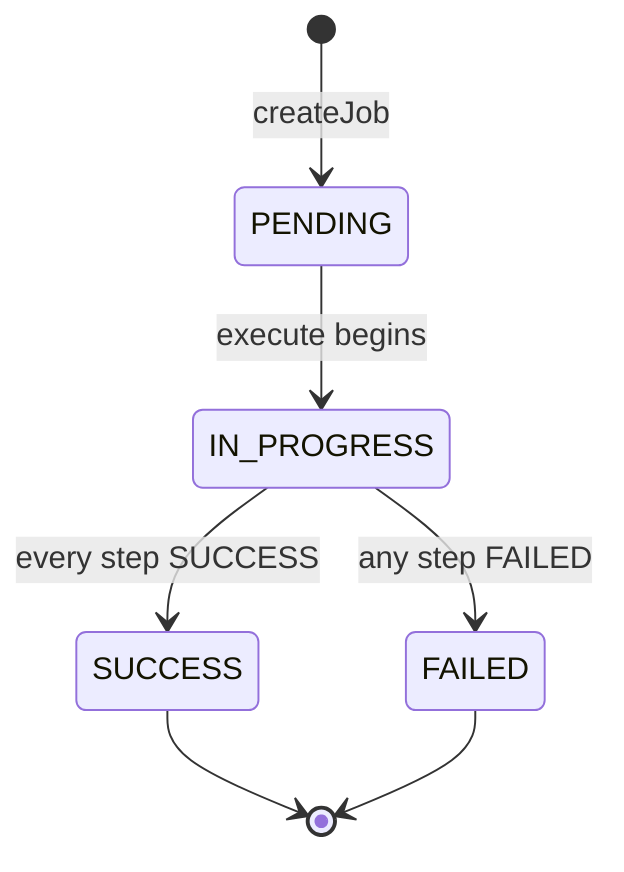
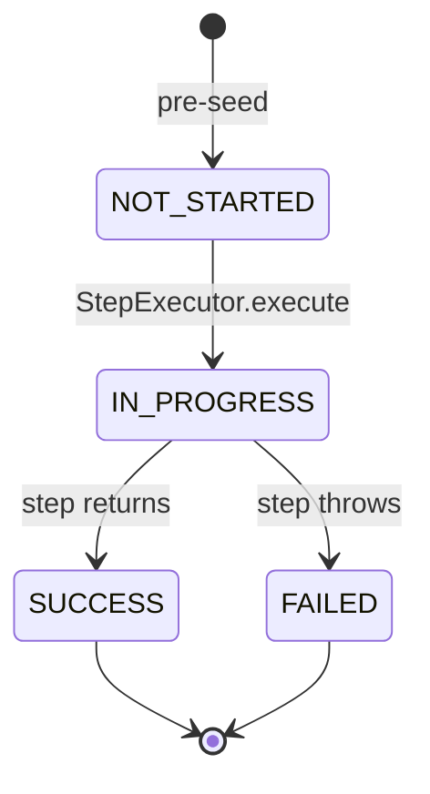
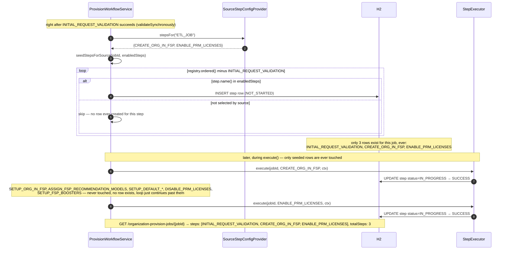

# Diagrams

All diagrams are Mermaid — GitHub renders them inline in the browser and they diff cleanly in pull requests.

## Package diagram



## Class diagram



## Sequence — successful workflow



## Sequence — failed workflow

```mermaid
sequenceDiagram
    autonumber
    participant WS as ProvisionWorkflowService
    participant SE as StepExecutor
    participant Step as AssignFspRecommendationModelsStep
    participant Ext as ExternalOrganizationClient
    participant FT as StepFailureTranslator
    participant DB as H2

    WS->>SE: execute(jobId, ASSIGN_FSP_RECOMMENDATION_MODELS, ctx)
    SE->>DB: UPDATE step ASSIGN_FSP_RECOMMENDATION_MODELS status=IN_PROGRESS
    SE->>Step: execute(ctx)
    Step->>Ext: assignFspRecommendationModels(orgId)
    Ext--x Step: ExternalCallException(401, "Unauthorized")
    Step--x SE: propagates
    SE->>FT: translate(exception)
    FT-->>SE: StepFailure("401", "Unauthorized")
    SE->>DB: UPDATE step ASSIGN_FSP_RECOMMENDATION_MODELS status=FAILED, errorCode, errorMessage
    Note over SE: @Transactional(REQUIRES_NEW, noRollbackFor=StepExecutionException) — the FAILED write survives the throw
    SE--x WS: StepExecutionException(ASSIGN_FSP_RECOMMENDATION_MODELS)
    WS->>DB: UPDATE job status=FAILED, finishedAt
    Note over DB: SETUP_DEFAULT_BRANDING_PRM_PREFERENCES..SETUP_FSP_BOOSTERS remain NOT_STARTED (pre-seeded) —<br/>this assumes source=DEFAULT (all steps seeded); a restricted source simply has fewer rows to leave NOT_STARTED
```

## Sequence — retry resumes at the failed step

Same request body, same `org_uid`, resubmitted after the failure above.
`CREATE_ORG_IN_FSP` / `SETUP_ORG_IN_FSP` (already `SUCCESS`) and
`INITIAL_REQUEST_VALIDATION` (already `SUCCESS`) are **not** re-run —
`resumeFromOrder` skips every step ordered below the first non-terminal
one.



Note the asymmetry: `findOrCreateJob` (step 2 above) refreshes only
`serviceUserAccount`/`externalJobUid` on the existing row — `orgType`
and `source` are deliberately left untouched here even if this retry's
request body specifies different values for them. They can only be
corrected while the job is still stuck at `INITIAL_REQUEST_VALIDATION`
(handled by `validateSynchronously`, which always uses the *current*
request's raw values); once resumed past validation, `execute` always
reconstructs `orgType`/`source` from what was persisted the first time
validation succeeded, so a job's step selection can never desync
mid-flight from a later request that tries to change them.

## State transitions

### Workflow status



### Step status



A step is pre-seeded `NOT_STARTED` **only if `source` selected it** —
see the seeding sequence below. Steps outside that set never enter
this state machine at all; there's no row, so there's no status to
report. For a seeded step, when the orchestrator reaches it, it always
executes (`IN_PROGRESS` → `SUCCESS`/`FAILED`) — `ProvisionStep` has no
per-step business gate, so `source` selecting a step is the only
condition that determines whether it runs.

## Sequence — source restricts which steps are even seeded

The request's `source` selects the fixed set of steps that caller may
trigger at all
([`source_config.json`](../src/main/resources/source_config.json)) —
and it does so at **seed time**, right after
`INITIAL_REQUEST_VALIDATION` succeeds, not by marking excluded steps
some other status during execution. Shown for `source = "ETL_JOB"`,
whose profile only lists `CREATE_ORG_IN_FSP` and `ENABLE_PRM_LICENSES`
— every other step never gets a row at all, so it can never appear in
a `GET`/`POST` response for this job, under any status. The two steps
that *are* seeded keep their normal catalog order relative to each
other (`ENABLE_PRM_LICENSES` still runs after `CREATE_ORG_IN_FSP`,
despite everything between them in the catalog never existing for this
job).


